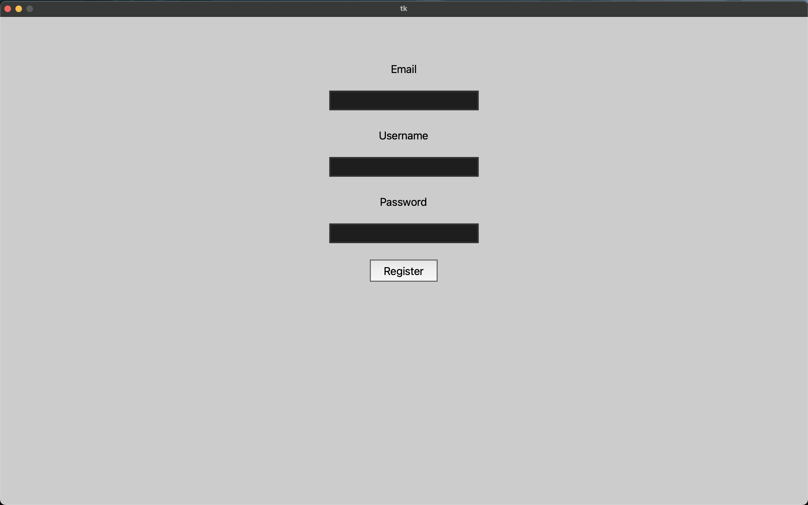
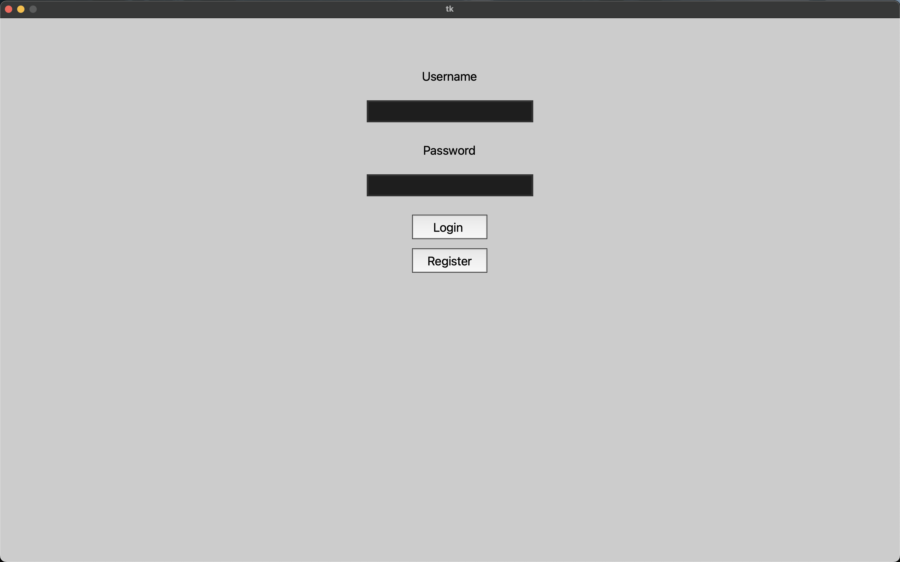
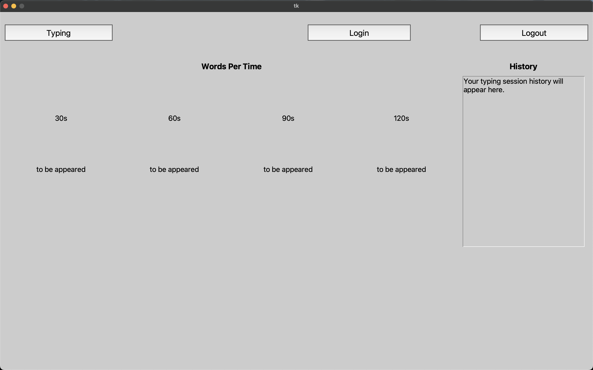
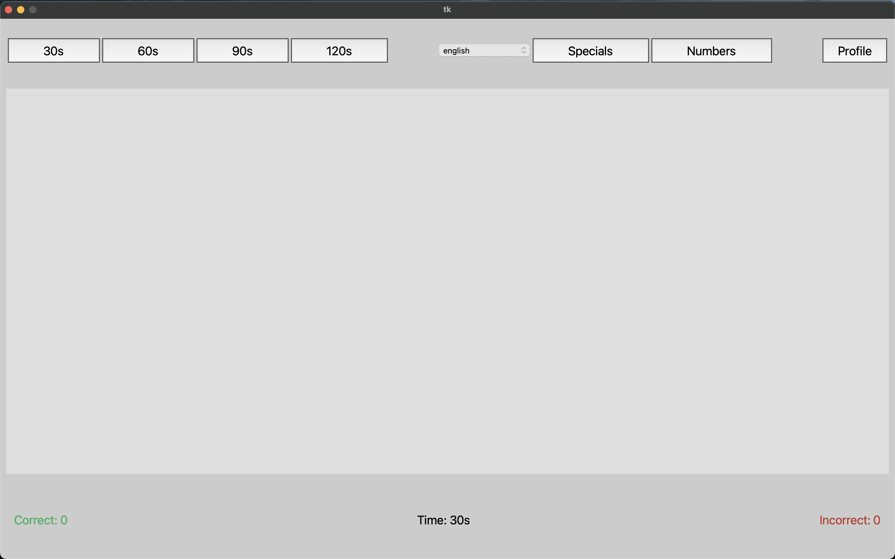

# Typing Speed ⌨️

Project for assessing the user's typing speed given a set of words, which may include special characters or/and numbers, using the Tkinter library.

---

## 📘 How Does It Work?

Typing Speed provides an interactive and different way to test your typing skills through a simple and intuitive Tkinter interface. The application 
includes essential yet impactful functionalities, such as user registration and login. While typing test results are not currently stored, 
this feature and some others are planned for future updates.

The application consists of four main interfaces (Frames), each serving a specific purpose:

### 1. Register  
- Allows new local users to register and store their credentials locally in a JSON file.  
- The registration process requires the following:  
  - **Email address** (e.g., `userprimary@gmail.com`).  
  - **Username** (e.g., `UserPrimary`).  
  - **Password** (e.g., `secure_password_538_#%$`).  
- To proceed, you have two options:  
  - Click the `Register` button.  
  - Press the `Return` or `Enter` key.  
- After submitting, one of two outcomes will occur:  
  1. If all fields are correctly filled, a confirmation message will appear, and you will be redirected to the Typing Test interface.  
  2. If any required fields are missing, an error message will prompt you to complete them.  



### 2. Log In  
- Allows registered users to access their profiles using valid credentials.  
- The login process requires:  
  - **Username**  
  - **Password**  
- Just like in the Register interface, you have two ways to proceed:  
  - Click the `Login` button.  
  - Press the `Return` or `Enter` key.  
- After submitting, one of the following will happen:  
  1. If the username exists and the password is correct, a confirmation message will appear, and you will be redirected to the Typing Test interface.  
  2. If the username exists but the password is incorrect, an error message will prompt you to try again.  
  3. If the username does not exist, an error message will appear, and the input fields will be cleared. Ensure that the username is registered before attempting to log in.  



### 3. Profile  
- Displays user-specific information, such as past test results (history) and best WPM across all available time settings.  
- Includes three buttons:  
  - `Typing`: Returns to the Typing Test interface.  
  - `Login`: Returns to the Login interface.  
  - `Logout`: Returns to the Login interface.  
  - **Note:** Although both `Login` and `Logout` redirect to the same interface, they are intended to serve different purposes.  
- Currently, user-specific information is not yet implemented, but it is planned for future updates.
 


### 4. Typing Test  
- Displays and manages the typing test by generating random words across four lines, along with a guide at the top of the interface.  
- Offers four time options to suit your preference:  
  - `30s`: Sets the test duration to 30 seconds (default).  
  - `60s`: Sets the test duration to 60 seconds.  
  - `90s`: Sets the test duration to 90 seconds.  
  - `120s`: Sets the test duration to 120 seconds.  
- Provides three additional configuration options for customizing the typing test:  
  - `Language`: Selects the preferred language. The default is English, and currently, only English and Spanish are available.  
  - `Specials`: Enables special characters in the typing test. Disabled by default.  
  - `Numbers`: Enables numbers in the typing test. Disabled by default.  
- Includes a `Profile` button, which redirects to the Profile interface.  
- Once all configurations are set, press the `Return` or `Enter` key to start the typing test.  
  - **Note:** During the test, you cannot stop, restart, or use any other buttons until the timer reaches 0.  
- When the test ends (timer reaches 0), a summary will display key performance metrics.  
- To start a new typing test, press the `Escape` or `Esc` key.  
  - **Note:** All previously selected configurations will remain unchanged, so there is no need to reconfigure them.



---

## 🪛 Application Configuration

### Interface Configurations
All interfaces are built using **Tkinter Frames**, but they follow a modular approach by utilizing **sub-Frames** (which are also Tkinter Frames). This modular design makes it easier to modify individual sections of an interface. However, in most cases, modifying a specific section requires adjusting the entire section’s configuration to ensure proper layout and adaptation.

To modify the interfaces, you can update the corresponding sections in any of the following files:
#### `register_ui.py`
- **`configure_layout()`** – Sets up the main layout and grid structure.
- **`create_form()`** – Creates and configures the registration form.

#### `login_ui.py`
- **`configure_layout()`** – Sets up the main layout and grid structure.
- **`create_form()`** – Creates and configures the login form.

#### `profile_ui.py`
- **`configure_layout()`** – Sets up the main layout and grid structure.
- **`create_top_bar()`** – Creates and configures the top bar with buttons.
- **`create_metric_displays()`** – Creates and configures widgets to display user metrics.

#### `main_ui.py`
- **`configure_layout()`** – Sets up the main layout and grid structure.
- **`create_top_bar()`** – Creates the top navigation bar with buttons and separators.
- **`create_canvas()`** – Creates and configures the canvas for displaying text.
- **`create_bottom_bar()`** – Creates and configures the bottom bar to display metrics.

By modifying these functions, you can easily adjust the application's interface to suit your needs.

### Font, Size, and Color Configurations
All text and graphical elements follow a **centralized style system** defined in a single dictionary. This means that modifying these styles will automatically update all elements that use them. However, this configuration provides only **general styles** and does not cover every element individually. Many specific styles are defined within their respective files.

The general styles include:
- **Typography**: Font family used across the application.
- **Font Size**: Default text size for different elements.
- **Font Color**: Standard text colors.
- **Font Type**: Bold, italic, or normal styles.
- **Background Color**: The main background color of the application.
- **Additional Colors**: Colors for buttons, highlights, and other UI components.

To modify these general styles, update the `self.styles` dictionary in the `ui.py` file. Currently, this is the code used:
- ````python
  self.styles: dict = {
      "background_color": "#CCCCCC",
      "button_font": ("Segoe UI", 20, "normal"),
      "button_font_color": "#000000",
      "button_active_color": "#3A5A8C",
      "canvas_color": "#DfDEDE",
      "title_label_font": ("Segoe UI", 20, "bold"),
      "body_label_font": ("Segoe UI", 18, "normal"),
      "label_font_color": "#000000",
      "canvas_label_font": ("Segoe UI", 50, "normal"),
      "canvas_guide_font": ("Segoe UI", 40, "italic"),
      "guide_font_color": "#50a5ff"
  }

### Typing Test Configurations
The typing test includes several configurable options that allow you to modify its behavior. These settings are simple but can significantly impact core functionalities.

All relevant code for these configurations is located in a single file. Below are the key sections you can modify:
#### `main_ui.py`
- ```python
  self.maxChars: dict = {"canvas": 40, "specials": 2, "numbers": 2}
  
- **`self.maxChars`** - A dictionary that defines key configuration parameters for text line generation. It includes the following key-value pairs:
  - "canvas": Specifies the maximum number of characters allowed in a single text line.
  - "specials": Defines the maximum number of special characters allowed per line when enabled.
  - "numbers": Sets the maximum number of numerical characters allowed per line when enabled.

- ```python
  self.bindings: list = [
      ("<Return>", self.start_typing_test),
      ("<Escape>", self.finish_typing_test),
      ("<KeyPress>", self.check_typing),
  ]

- **`self.bindings`** - A list containing tuples that define key bindings available in the current frame. Each tuple consists of:
  - "<KeyBind>": The name of the key to be bound. Note that key names may vary depending on the operating system.
  - "bind_function": The function to be executed when the key is pressed. This function must accept a Tkinter `Event` object as an argument.

- ```python
  self.forbiddenKeys: list = [
      "Return", "Escape", "Shift_L", "Shift_R", "Alt_L", "Alt_R", "Caps_Lock", "Control_L", "Control_R",
      "Delete", "Tab", "BackSpace", "Meta_L", "Meta_R",
  ]

- **`self.forbiddenKeys`** - A list of key names that are explicitly disabled in the current frame. Pressing these keys will have no effect. Keep in mind that key names may differ based on your operating system.

- ```python
  self.language: StringVar = StringVar(self)
  self.language.set("english")

- **`self.language.set()`** - This method initializes the `language` variable with a default language for the typing test. The specified language must be written in lowercase and must be available within the application.

- ```python
  self.set_time_variable(30)
  
- **`self.set_time_variable()`** - This method sets a default duration for the typing test by modifying the `self.seconds` variable. While there are no strict restrictions on the values that can be used, it is highly recommended to choose one of the predefined options (30, 60, 90, or 120) to ensure consistent metric results and avoid unexpected behavior.

### Language Configurations
There are three main ways to modify the language settings. These changes are simple to implement but not the only possible modifications. The three main actions are: adding a **new language**, **updating an existing language**, or **deleting a language**.

- **Add a language** - To add a new language, follow these three steps:
  - Create a new `.txt` file in the same directory as the code, using the naming format: `language_words.txt`.
  - Populate the file with words from the new language, ensuring each word is on a separate line and avoiding blank spaces.
  - Register the language by adding it to the `self.availableLangs` list in `main_ui.py`:
  - ```python
    self.availableLangs: list = ["english", "spanish", "<language>"]
- **Update a language** - To update an existing language, simply modify the contents of its corresponding `.txt` file. Be sure to maintain both the naming format and content structure.
- **Delete a language** - To remove a language, delete its `.txt` file and remove its entry from the `self.availableLangs` list in `main_ui.py`.

### Numbers and Specials Configurations
Modifying the configurations or content available for the typing test follows a process very similar to **Language Configurations**. However, in this case, you only need to update the content of two specific files:

- **Modify Numbers** - Edit the `numbers_file.txt` file, ensuring that:
  - The naming format remains unchanged.
  - Each number is placed on a separate line.
  - Blank spaces are avoided.
- **Modify Specials** -  Edit the `specials_file.txt` file, making sure that:
  - The naming format remains unchanged.
  - Each special character is placed on a separate line.
  - Blank spaces are avoided.

---

## 💡 Notes

- This is the most significant personal project I’ve worked on so far. Because of that, I made sure to understand every part of the code in depth. If you have any doubts, feel free to contact me, and I’ll do my best to help.
- Some parts of the code might be complex to understand, but I’ve tried to make everything as clear as possible based on my knowledge and skills.
- The interface design isn’t the best, but the functionality is solid. I enjoy designing UIs, but coding them is not my favorite part, so feel free to improve the design however you like.
- I plan to implement new features and improve the existing code in the future. However, for now, I want to focus on other projects and continue learning new things.

---

## 📚 Useful Resources  

Here are some helpful resources to better understand the technologies and libraries used in this project:  

- **[Tkinter Documentation](https://docs.python.org/3/library/tk.html)** – Official Python documentation for Tkinter, the GUI library used in this project.  
- **[Tkinter Frame Documentation](https://tkdocs.com/pyref/frame.html)** – Detailed reference for Tkinter's `Frame` widget, useful for UI structuring.  
- **[Tkinter Key Names](https://anzeljg.github.io/rin2/book2/2405/docs/tkinter/key-names.html)** – A comprehensive list of key names used in Tkinter for handling keyboard events.  
- **[Python hashlib Documentation](https://docs.python.org/3/library/hashlib.html)** – Official Python documentation for `hashlib`, which provides secure hash functions.  
- **[Python importlib Documentation](https://docs.python.org/3/library/importlib.html)** – Documentation for `importlib`, the module used for dynamic imports in Python.  

---

From: *[LeoJimenezG](https://github.com/LeoJimenezG)*
